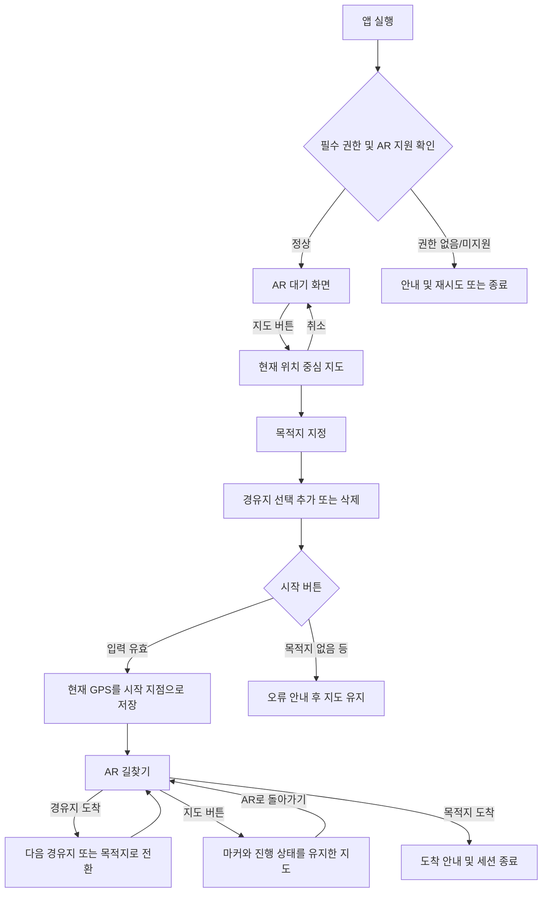
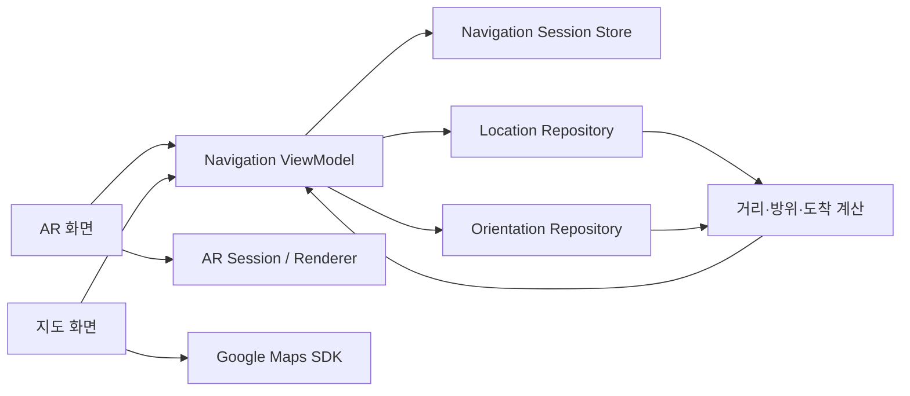

# Android 기반 AR 내비게이션 앱 기획서

## 1. 문서 개요

| 항목 | 내용 |
|---|---|
| 문서명 | Android 기반 AR 내비게이션 앱 기획서 |
| 목적 | Google 지도에서 사용자가 지정한 경유지와 목적지를 AR 카메라 화면의 3D 방향 인디케이터로 안내하는 예제 앱 정의 |
| 대상 플랫폼 | Android 스마트폰 및 ARCore 지원 Android 기기 |
| 주요 기술 | ARCore, Google Maps SDK for Android, Android 위치 서비스, 방향 센서 |
| 문서 범위 | MVP 기능, 화면/상태/데이터/기술 정책, 예외 처리, 검수 기준 |

이 앱은 자동차용 도로 내비게이션이 아니라, 사용자가 지도에서 직접 지정한 지점들을 보행 환경에서 순서대로 찾아갈 수 있도록 돕는 AR 방향 안내 예제다. MVP에서는 외부 길찾기 API가 계산한 도로 경로가 아닌 `시작 지점 → 경유지 → 목적지`의 좌표 순서를 기준으로 안내한다.

---

## 2. 기획 배경 및 목표

### 2.1 배경

일반 지도는 경로 전체를 파악하기에는 유용하지만, 사용자가 실제 공간에서 어느 방향으로 움직여야 하는지 즉시 이해하기 어려울 수 있다. AR 카메라 화면의 바닥면 위에 다음 지점을 가리키는 3D 인디케이터를 표시하면 지도와 현실 공간을 연결해 보다 직관적인 안내 경험을 제공할 수 있다.

### 2.2 목표

- 현재 위치 중심의 지도에서 목적지와 복수의 경유지를 쉽게 지정한다.
- 지정한 순서에 따라 다음 안내 지점을 결정한다.
- ARCore가 인식한 바닥면에 다음 지점을 향하는 3D 인디케이터를 표시한다.
- 지도와 AR 화면을 오가더라도 설정한 마커와 내비게이션 진행 상태를 유지한다.
- 위치, 방향 센서 또는 AR 추적 품질이 낮을 때 잘못된 안내 대신 명확한 상태 메시지를 제공한다.

### 2.3 MVP 제외 범위

- 도로/보행로를 따르는 실제 경로 탐색 및 턴바이턴 안내
- 교통 상황, 예상 도착 시간, 음성 안내
- 백그라운드 위치 추적 및 화면이 꺼진 상태의 안내
- 계정, 경로 저장/공유, 서버 동기화
- 실내 측위, 층간 이동, 장애물 회피
- ARCore Geospatial API 기반 VPS 정밀 측위

향후 Google Routes API 등을 연동하면 도로를 따르는 경로 및 예상 시간 기능으로 확장할 수 있다.

---

## 3. 핵심 용어와 정책

| 용어 | 정의 |
|---|---|
| 시작 지점 | 사용자가 `시작`을 누르는 시점의 최신 유효 GPS 좌표. 지도에 시작 마커로 고정한다. |
| 경유지 | 지도에서 사용자가 추가한 중간 목적 좌표. 추가한 순서를 방문 순서로 사용한다. |
| 목적지 | 최종 도착 좌표. 한 개만 존재하며 새로 지정하면 기존 목적지를 교체한다. |
| 현재 안내 지점 | 아직 도착하지 않은 경유지 중 순서상 첫 지점. 남은 경유지가 없으면 목적지다. |
| 길찾기 세션 | 시작 지점, 경유지 목록, 목적지와 진행 상태를 묶은 한 번의 안내 단위다. |
| 도착 판정 | 현재 위치와 현재 안내 지점 사이의 거리가 도착 반경 안에 일정 시간 연속으로 들어온 상태다. |

### 3.1 기본 수치

아래 값은 초기 권장값이며 현장 테스트 후 조정할 수 있도록 상수 또는 원격 설정 가능한 값으로 분리한다.

| 항목 | 초기값 | 설명 |
|---|---:|---|
| 경유지 도착 반경 | 10 m | GPS 오차를 고려한 경유지 통과 기준 |
| 목적지 도착 반경 | 10 m | 최종 도착 기준 |
| 도착 유지 시간 | 3초 | 순간적인 위치 튐에 의한 오판 방지 |
| 위치 정확도 경고 기준 | 25 m 초과 | 정확도가 낮음을 사용자에게 알림 |
| 방향 갱신 최소 회전량 | 2° | 미세 센서 노이즈에 의한 떨림 억제 |
| 인디케이터 위치 | 카메라 전방 약 1.5 m | 인식한 바닥면 위 가시 위치에 배치 |

> `가장 가까운 마커`를 매 프레임 단순 선택하면 지나온 경유지를 다시 가리킬 수 있다. 따라서 MVP는 사용자가 지정한 방문 순서를 우선하며, 이미 도착 처리된 지점은 안내 대상에서 제외한다.

---

## 4. 사용자 흐름



### 4.1 대표 시나리오

1. 사용자가 앱을 실행하고 카메라 및 위치 권한을 허용한다.
2. AR 화면에서 `지도`를 눌러 현재 위치 중심의 지도 화면을 연다.
3. `목적지`를 누른 뒤 지도 한 지점을 눌러 목적지를 지정한다.
4. 필요하면 `경유지`를 눌러 추가 모드에 진입하고 지도에서 여러 지점을 순서대로 누른다.
5. 추가된 경유지 마커를 누르면 해당 경유지가 삭제된다. `경유지 완료`를 누르면 추가 모드가 끝난다.
6. `시작`을 누르면 최신 현재 위치가 시작 지점으로 저장되고 AR 화면으로 전환된다.
7. AR 화면은 인식된 바닥면에 현재 안내 지점을 향하는 3D 인디케이터와 거리 정보를 표시한다.
8. 현재 안내 지점에 도착하면 자동으로 다음 지점으로 안내 대상이 바뀐다.
9. 목적지 도착 시 도착 메시지를 표시하고 길찾기를 종료한다.

---

## 5. 화면 구성 및 상세 기능

### 5.1 AR 화면

#### 목적

카메라 영상과 현실 공간 위에서 다음 안내 지점의 방향과 남은 거리를 직관적으로 전달한다.

#### 화면 요소

| 영역 | 요소 | 동작/표시 |
|---|---|---|
| 상단 | 상태 배너 | AR 평면 탐색, GPS 정확도 낮음, 나침반 보정 필요 등의 상태 표시 |
| 상단 중앙 | 안내 지점 정보 | `경유지 1/3` 또는 `목적지`, 직선거리 표시 |
| 중앙/바닥면 | 3D 방향 인디케이터 | 현재 안내 지점의 방위각을 향하도록 회전. 바닥면 위에 배치 |
| 하단 | 지도 버튼 | 지도 화면으로 전환. 진행 중이면 기존 마커와 진행 상태 유지 |
| 하단 | 안내 종료 버튼 | 진행 중일 때만 노출. 확인 후 세션 종료 |

#### 상태별 동작

##### 길찾기 전

- 카메라 프리뷰와 ARCore 평면 탐색 상태를 표시한다.
- `지도` 버튼으로 지도 화면에 진입한다.
- 안내 지점 정보와 3D 인디케이터는 표시하지 않는다.

##### 길찾기 중

- 현재 위치에서 현재 안내 지점까지의 직선거리와 지점 종류를 표시한다.
- GPS 좌표로 두 지점 사이의 절대 방위각을 계산한다.
- 회전 벡터 센서 기반의 기기 방위와 화면 회전을 보정해 카메라 좌표계의 상대 각도로 변환한다.
- ARCore가 인식한 수평 상향 평면 중 카메라 앞의 안정적인 바닥 후보에 인디케이터를 배치한다.
- 새 위치/방향 값에 저역 통과 필터 또는 보간을 적용해 인디케이터 떨림을 줄인다.
- 안내 지점 도착 판정 후 다음 미도착 경유지 또는 목적지로 자동 전환한다.
- 지도 화면으로 이동해도 세션은 중단되지 않으며 시작, 경유지, 목적지와 완료된 경유지를 구분해 표시한다.

##### 평면 미인식

- 화면 중앙에 `휴대폰을 천천히 움직여 바닥을 인식해 주세요`를 표시한다.
- 평면이 잡히기 전에는 3D 인디케이터를 임의의 바닥 위치에 고정하지 않는다.
- 선택 사항으로 화면 가장자리의 2D 방향 화살표를 보조 표시해 안내 단절을 줄인다.

##### 추적/센서 품질 저하

- ARCore 추적 중단 시 마지막 위치에 모델을 고정하지 않고 숨긴 뒤 재탐색 메시지를 표시한다.
- 위치 정확도가 기준보다 나쁘면 거리/방향 정보를 흐리게 하고 `GPS 정확도 낮음`을 표시한다.
- 자기장 간섭이 감지되거나 방향 값 신뢰도가 낮으면 `휴대폰을 8자 모양으로 움직여 나침반을 보정해 주세요`를 표시한다.

#### 인디케이터 표현 원칙

- 기본 모델은 바닥 위 화살표 또는 갈매기표 형태로 한다.
- 경유지는 파란색, 목적지는 녹색 등 색상과 텍스트를 함께 사용해 색각 이상 사용자도 구분할 수 있게 한다.
- 모델은 카메라에서 지나치게 멀어지지 않도록 전방 고정 거리 내에 표시하되 방향만 실제 목표를 가리킨다.
- 실제 장애물이나 통행 가능 경로를 인식한 것처럼 오해할 표현은 피한다.

### 5.2 지도 화면

#### 목적

현재 위치를 확인하고 목적지 및 경유지를 편집하며 길찾기를 시작한다.

#### 화면 요소

| 영역 | 요소 | 동작/표시 |
|---|---|---|
| 지도 | Google 지도 | 최초 진입 시 최신 현재 위치 중심으로 이동. 이후 사용자의 이동/확대/축소를 방해하지 않음 |
| 지도 | 현재 위치 | 위치 권한이 있을 때 현재 위치 레이어와 정확도 범위 표시 |
| 지도 | 시작 마커 | 길찾기 시작 시점의 위치. 진행 중에만 표시 |
| 지도 | 경유지 마커 | 추가 순서 번호 표시. 완료/미완료 상태를 시각적으로 구분 |
| 지도 | 목적지 마커 | 하나만 표시. 재지정 시 교체 |
| 하단 | 목적지 버튼 | 목적지 지정 모드 진입/해제 |
| 하단 | 경유지 버튼 | 경유지 추가 모드 진입. 활성 상태에서는 `경유지 완료`로 표시 |
| 하단 | 시작 버튼 | 입력 검증 후 길찾기 시작 및 AR 화면 전환 |
| 하단 | 취소 버튼 | 변경 내용을 폐기하고 AR 화면으로 복귀 |
| 선택 | 현재 위치 버튼 | 지도를 현재 위치 중심으로 다시 이동 |

#### 지도 편집 모드

동시에 하나의 편집 모드만 활성화한다.

| 모드 | 지도 빈 영역 터치 | 마커 터치 | 종료 방식 |
|---|---|---|---|
| 기본 | 지도 탐색만 수행 | 마커 정보 표시 | 다른 모드 선택 |
| 목적지 지정 | 해당 좌표에 목적지 생성 또는 기존 목적지 이동 | 해당 마커 정보 표시 | 지점 지정 즉시 기본 모드 복귀 |
| 경유지 추가 | 터치한 순서대로 번호가 붙은 경유지 계속 추가 | 경유지 터치 시 삭제 후 번호 재정렬 | `경유지 완료` 버튼 터치 |

#### 시작 버튼 입력 검증

다음 조건을 모두 만족할 때만 길찾기를 시작한다.

- 목적지가 설정되어 있다.
- 위치 권한이 허용되어 있다.
- 위치 서비스가 켜져 있다.
- 최근의 유효한 현재 위치가 존재한다.
- 현재 위치 정확도가 시작 허용 기준 이내다. 기준을 넘으면 재시도 또는 사용자 확인 정책을 적용한다.

성공 시 다음을 한 번의 작업으로 처리한다.

1. 최신 위치를 시작 마커로 저장한다.
2. 경유지 추가 순서를 확정한다.
3. 첫 번째 미도착 경유지 또는 목적지를 현재 안내 지점으로 설정한다.
4. 길찾기 상태를 `진행 중`으로 변경한다.
5. AR 화면으로 전환한다.

#### 취소 정책

- 길찾기 시작 전 지도 편집 중 `취소`: 이번 지도 진입 후 변경한 목적지/경유지를 폐기하고 직전 AR 화면으로 복귀한다.
- 진행 중 지도 확인 후 `AR로 돌아가기`: 세션 및 마커 변경 없이 AR 화면으로 복귀한다.
- 진행 중 경로 편집은 MVP에서 허용하지 않는다. 변경이 필요하면 기존 안내를 종료하고 새 경로를 설정한다.

이 정책은 `취소하면 아무것도 하지 않고 AR 화면으로 전환`한다는 요구사항을 데이터 변경까지 취소하는 의미로 명확화한 것이다.

---

## 6. 내비게이션 상태 정의

| 상태 | 설명 | 진입 조건 | 종료 조건 |
|---|---|---|---|
| `IDLE` | 안내 없음 | 최초 실행, 취소, 안내 종료 | 지도 편집 시작 |
| `EDITING` | 목적지/경유지 편집 | 지도 진입 후 편집 | 취소 또는 시작 |
| `NAVIGATING` | AR 안내 진행 | 유효한 입력으로 시작 | 도착, 사용자 종료, 치명 오류 |
| `PAUSED_QUALITY` | 센서/위치/AR 품질 부족으로 표시 일시 중단 | 신뢰도 기준 미달 | 품질 회복 또는 사용자 종료 |
| `ARRIVED` | 목적지 도착 | 목적지 도착 판정 | 확인 후 `IDLE` |

### 6.1 안내 대상 선택 로직

```text
미도착 경유지가 있으면
    추가 순서가 가장 빠른 미도착 경유지를 선택
그렇지 않고 목적지가 미도착이면
    목적지를 선택
그렇지 않으면
    목적지 도착 처리 후 세션 종료
```

### 6.2 위치 기반 계산

- 거리: 현재 GPS와 목표 좌표 사이의 지표면 거리로 계산한다.
- 절대 방위각: 현재 좌표에서 목표 좌표로 향하는 초기 방위각을 계산한다.
- 상대 방향: `목표 절대 방위각 - 보정된 기기 방위각`을 -180°~180° 범위로 정규화한다.
- 위치와 방향 샘플은 서로 다른 주기로 도착하므로 최신 유효값의 타임스탬프와 정확도를 함께 관리한다.
- 오래된 위치는 안내 계산에 사용하지 않고 새 위치를 기다린다.

---

## 7. 데이터 모델

```text
NavigationSession
  - sessionId: String
  - status: IDLE | EDITING | NAVIGATING | PAUSED_QUALITY | ARRIVED
  - startPoint: NavigationPoint?
  - waypoints: List<NavigationPoint>
  - destination: NavigationPoint?
  - currentTargetId: String?
  - startedAt: Instant?

NavigationPoint
  - id: String
  - type: START | WAYPOINT | DESTINATION
  - latitude: Double
  - longitude: Double
  - order: Int?
  - arrivalStatus: PENDING | ARRIVED | SKIPPED
```

### 7.1 상태 보존

- 화면 전환과 화면 회전 시 세션이 사라지지 않도록 화면 생명주기와 분리된 상태 저장소를 사용한다.
- 프로세스가 일시 종료된 경우를 대비해 편집 중인 좌표와 진행 세션을 로컬 저장할 수 있다.
- 앱 강제 종료 후 진행 중 세션 복원은 MVP에서 선택 기능으로 두며, 복원 시 반드시 사용자에게 재개 여부를 확인한다.

---

## 8. 권한 및 최초 실행

### 8.1 필요 권한

| 권한/기능 | 사용 이유 | 거부 시 |
|---|---|---|
| 카메라 | AR 카메라 및 평면 인식 | AR 기능 사용 불가 안내, 설정 이동 또는 종료 제공 |
| 정밀 위치 | 현재 위치, 거리 및 방향 계산 | 지도 탐색은 가능하나 길찾기 시작 불가 |
| 위치 서비스 | GPS/네트워크 위치 수신 | 활성화 요청 화면 제공 |

- 백그라운드 위치 권한은 요청하지 않는다.
- 권한 요청 전에 사용 목적을 설명한다.
- 영구 거부 상태에서는 앱 설정으로 이동할 수 있는 버튼을 제공한다.
- ARCore 미지원 기기 또는 관련 서비스 설치/업데이트 필요 상태를 구분해 안내한다.

### 8.2 최초 실행 순서

1. ARCore 지원 여부와 관련 서비스 상태를 확인한다.
2. 카메라 권한의 필요성을 설명하고 요청한다.
3. 위치 권한의 필요성을 설명하고 정밀 위치를 요청한다.
4. 위치 서비스가 꺼져 있으면 활성화를 유도한다.
5. 준비가 끝나면 AR 대기 화면을 연다.

---

## 9. 예외 및 오류 처리

| 상황 | 사용자 안내 | 앱 동작 |
|---|---|---|
| 목적지 없이 시작 | `목적지를 먼저 지정해 주세요` | 지도 유지, 목적지 모드 진입 유도 |
| 현재 위치 수신 실패 | `현재 위치를 확인할 수 없습니다` | 재시도 제공, 시작 차단 |
| GPS 정확도 낮음 | `더 트인 곳에서 위치 정확도를 높여 주세요` | 방향 표시 일시 중단 또는 낮은 신뢰도 표시 |
| 나침반 정확도 낮음 | 보정 방법 안내 | 안정될 때까지 방향 신뢰도 경고 |
| 바닥면 미인식 | 기기를 천천히 움직이라는 안내 | 3D 인디케이터 숨김, 평면 탐색 계속 |
| AR 추적 손실 | `주변을 다시 비춰 주세요` | 모델 숨김, 추적 복구 시 재표시 |
| 지도 로딩 실패 | 네트워크 확인 및 재시도 안내 | 저장된 마커 유지, 재시도 제공 |
| ARCore 미지원 | 지원 기기 필요 안내 | 지도만 제한적으로 제공하거나 앱 종료 정책 선택 |
| 목적지와 현재 위치가 도착 반경 이내 | 즉시 도착 가능 안내 | 시작 직후 목적지 도착 처리 |
| 경유지 중복/과밀 | 가까운 기존 지점 존재 안내 | 일정 거리 이내 중복 추가 방지 |

위치·센서 기반 방향은 실제 통행 가능 여부나 안전을 보장하지 않는다. 길을 건너거나 위험 구역에서 화면만 보지 않도록 상시 안전 문구를 제공하고, 3D 표시가 장애물 회피 안내로 오인되지 않게 한다.

---

## 10. 비기능 요구사항

### 10.1 성능

- AR 카메라 화면은 목표 30 FPS 이상을 유지한다.
- 위치/센서 갱신으로 UI 스레드가 차단되지 않게 한다.
- 3D 모델과 텍스처 용량을 제한하고 반복 생성하지 않는다.
- 위치 업데이트 주기는 이동성과 배터리 소모의 균형을 고려한다.

### 10.2 안정성

- Activity/Fragment 재생성 후에도 편집 및 안내 상태를 복구한다.
- 앱이 백그라운드로 이동하면 AR 세션과 센서 수신을 일시 중지한다.
- 앱 복귀 시 위치와 방향 값을 새로 확보한 뒤 안내를 재개한다.

### 10.3 접근성 및 사용성

- 색상만으로 마커 유형을 구분하지 않고 아이콘, 번호, 텍스트를 함께 사용한다.
- 버튼 터치 영역은 Android 접근성 권장 크기를 충족한다.
- TalkBack용 콘텐츠 설명을 제공한다.
- 햇빛 아래에서도 읽을 수 있도록 지도/카메라 위 텍스트에 충분한 대비와 배경을 적용한다.
- 거리 표기는 1 km 미만은 m, 이상은 km로 읽기 쉽게 변환한다.

### 10.4 개인정보

- 위치 좌표는 안내 기능에만 사용한다.
- MVP에서는 위치 이력을 외부 서버로 전송하지 않는다.
- 로그에는 정밀 좌표를 그대로 남기지 않거나 디버그 빌드로 제한한다.

---

## 11. 권장 기술 구성

| 영역 | 권장 구성 | 역할 |
|---|---|---|
| 언어/UI | Kotlin, Jetpack Compose 또는 기존 View 체계 | 화면 및 상태 표시 |
| 구조 | 단일 Activity + 화면별 UI, ViewModel, Repository | 생명주기와 상태 분리 |
| AR | ARCore 및 Android용 렌더링 계층 | 카메라 추적, 포인트 클라우드/평면 탐지, 3D 렌더링 |
| 지도 | Google Maps SDK for Android | 지도와 마커 표시 |
| 위치 | Fused Location Provider | 현재 위치와 정확도 수신 |
| 방향 | Rotation Vector Sensor 우선 | 기기 방위 계산 |
| 상태 저장 | SavedStateHandle 및 필요 시 로컬 DB/DataStore | 화면 전환/프로세스 복원 |

구현 시점의 최신 안정 버전과 공식 지원 상태를 확인해 라이브러리를 확정한다. AR 렌더링 계층은 프로젝트의 유지보수성과 3D 모델 요구사항을 검토한 후 선택한다.

포인트 클라우드는 평면 추적 상태 확인과 개발 디버깅에 활용하되, 일반 사용자 화면에는 기본적으로 노출하지 않는다. 실제 인디케이터 배치는 ARCore가 추적 중인 수평 상향 평면을 기준으로 한다.

### 11.1 논리 컴포넌트



---

## 12. 기능 요구사항 목록

| ID | 요구사항 | 우선순위 |
|---|---|---|
| FR-01 | 앱은 AR 화면과 지도 화면을 제공해야 한다. | Must |
| FR-02 | 지도 최초 진입 시 현재 위치를 중심으로 표시해야 한다. | Must |
| FR-03 | 사용자는 지도 터치로 한 개의 목적지를 지정하거나 교체할 수 있어야 한다. | Must |
| FR-04 | 사용자는 지도 터치로 복수 경유지를 순서대로 추가할 수 있어야 한다. | Must |
| FR-05 | 사용자는 경유지 마커를 눌러 삭제할 수 있어야 한다. | Must |
| FR-06 | 시작 시 현재 위치를 시작 마커로 저장해야 한다. | Must |
| FR-07 | 안내는 시작, 경유지 추가 순서, 목적지 순으로 진행되어야 한다. | Must |
| FR-08 | AR 화면은 인식된 바닥면에 현재 안내 지점을 향하는 3D 인디케이터를 표시해야 한다. | Must |
| FR-09 | AR/지도 화면 전환 시 마커와 안내 진행 상태를 유지해야 한다. | Must |
| FR-10 | 경유지 또는 목적지 도착을 자동 판정하고 다음 상태로 전환해야 한다. | Must |
| FR-11 | 취소 시 지도 편집 내용을 반영하지 않고 AR 화면으로 돌아가야 한다. | Must |
| FR-12 | 위치/방향/AR 추적 품질 저하 상태를 사용자에게 알려야 한다. | Must |
| FR-13 | 평면 미인식 시 2D 보조 화살표를 표시할 수 있다. | Should |
| FR-14 | 진행 중인 세션을 앱 재실행 후 복원할 수 있다. | Could |

---

## 13. 인수 조건

### 13.1 지도 화면

- 위치 권한과 위치 서비스가 정상일 때 지도 진입 후 현재 위치가 보인다.
- 목적지 모드에서 지도 빈 곳을 한 번 누르면 목적지 마커가 하나 생성된다.
- 목적지를 다시 지정하면 기존 마커가 제거되고 새 좌표에 하나만 남는다.
- 경유지 모드에서 지도를 여러 번 누르면 순서 번호가 붙은 마커가 각각 생성된다.
- 경유지 마커를 누르면 해당 마커가 삭제되고 남은 순서 번호가 재정렬된다.
- 목적지가 없으면 시작할 수 없으며 명확한 오류 메시지가 표시된다.
- 취소하면 이번 편집 내용이 저장되지 않고 AR 화면으로 복귀한다.

### 13.2 AR 화면

- 유효한 경로로 시작하면 AR 화면으로 전환되고 현재 안내 지점과 거리가 표시된다.
- 수평 평면이 인식되면 3D 인디케이터가 바닥면 위에 나타난다.
- 사용자가 제자리에서 회전하면 인디케이터는 목표 지점의 실제 방위 방향을 유지한다.
- 평면 또는 추적이 불안정하면 잘못된 위치의 인디케이터 대신 상태 안내가 표시된다.
- 현재 경유지 도착 후에는 완료된 지점이 다시 선택되지 않고 다음 경유지를 가리킨다.
- 마지막 경유지 이후 목적지를 가리키며, 목적지 도착 시 완료 메시지와 함께 안내가 종료된다.
- 안내 도중 지도에 진입하면 시작, 모든 경유지, 목적지와 완료 상태가 유지되어 보인다.

### 13.3 복구 및 예외

- 화면 회전이나 일시적인 백그라운드 전환 후에도 세션 데이터가 유지된다.
- 카메라 또는 위치 권한이 거부되면 앱이 종료되지 않고 원인과 해결 방법을 안내한다.
- GPS 정확도가 기준 밖이면 방향을 확정적으로 표시하지 않고 품질 경고를 제공한다.

---

## 14. 테스트 시나리오

| 구분 | 시나리오 | 기대 결과 |
|---|---|---|
| 정상 | 목적지 1개만 지정 후 시작 | 시작 지점에서 목적지로 바로 안내 |
| 정상 | 경유지 3개와 목적지 지정 후 시작 | 추가 순서대로 3개 경유 후 목적지 안내 |
| 편집 | 중간 경유지 삭제 | 해당 지점 삭제, 순서 번호 재정렬 |
| 전환 | 안내 중 지도↔AR 반복 | 경로와 현재 안내 지점 유지 |
| 도착 | 도착 반경 경계에서 위치가 흔들림 | 유지 시간 전에는 도착으로 오판하지 않음 |
| 방향 | 북쪽 기준으로 기기를 360° 회전 | 목표의 상대 화면 방향이 연속적으로 갱신 |
| 센서 | 자기장 간섭이 큰 장소 | 보정/신뢰도 경고 표시 |
| AR | 텍스처가 부족한 바닥 | 평면 탐색 안내, 오배치 방지 |
| 권한 | 카메라 권한 거부 | AR 사용 불가 안내와 설정 이동 제공 |
| 권한 | 위치 권한 거부 | 지도 열람 가능, 길찾기 시작 차단 |
| 생명주기 | 안내 중 앱을 백그라운드로 이동 후 복귀 | AR/센서 안전 재개 및 세션 유지 |

실외 GPS와 나침반 오차는 에뮬레이터만으로 검증할 수 없으므로, 방향이 다른 실제 목적지를 둔 야외 기기 테스트가 필수다. 금속 구조물 근처, 고층 건물 사이, 흐린 날씨 등 품질 저하 환경도 별도로 확인한다.

---

## 15. 개발 단계 제안

### 1단계: 지도 기반 경로 편집

- 권한 및 현재 위치
- 목적지/경유지 추가·삭제
- 경로 상태 저장과 지도 재표시

### 2단계: 위치 안내 엔진

- 거리와 방위각 계산
- 경유지 순차 진행 및 도착 판정
- GPS/방향 센서 품질 처리

### 3단계: AR 시각화

- ARCore 세션 및 수평 평면 인식
- 바닥면 위 3D 인디케이터 렌더링
- 상대 방향 반영, 보간, 추적 손실 처리

### 4단계: 통합 및 현장 검증

- 지도↔AR 상태 연동
- 권한/생명주기/예외 처리
- 실제 기기 야외 보정 및 수치 튜닝
- 접근성, 성능, 배터리 사용량 점검

---

## 16. 향후 확장 아이디어

- Routes API를 이용한 실제 보행 경로와 회전 지점 자동 생성
- 음성 및 진동 기반 다음 지점 안내
- 경로 이탈 감지와 재탐색
- ARCore Geospatial/VPS를 이용한 위치 정밀도 향상
- 목적지 검색, 장소 자동완성, 최근 경로 저장
- 스마트 글래스 입력 방식과 시야각에 맞춘 UI
- 경로 공유 및 다중 사용자 안내

---

## 17. 결정 필요 항목

개발 착수 전에 아래 항목을 제품 정책으로 확정한다.

1. MVP가 사용자의 지도 터치 좌표를 직선 순서로 안내하는 예제인지, 실제 보행로 기반 경로까지 포함하는지
2. 진행 중 지도 화면에서 경로 편집을 허용할지 여부
3. AR 평면 미인식 시 2D 보조 화살표를 필수로 제공할지 여부
4. 앱 강제 종료 후 진행 세션 복원을 지원할지 여부
5. ARCore 미지원 기기에서 지도 전용 모드를 허용할지 여부

본 기획서는 1번을 `직선 순서 안내`, 2번을 `편집 불가`, 3번을 `선택`, 4번을 `선택`, 5번을 `제품 정책에 따라 결정`으로 두고 MVP 범위를 정의했다.
